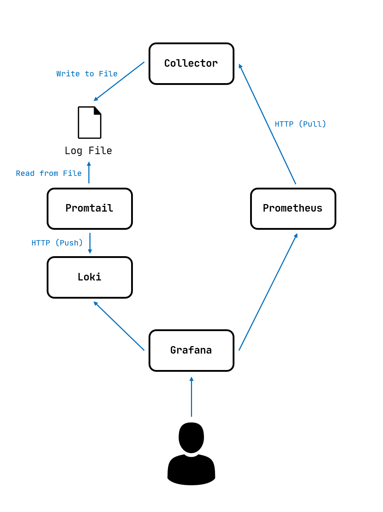
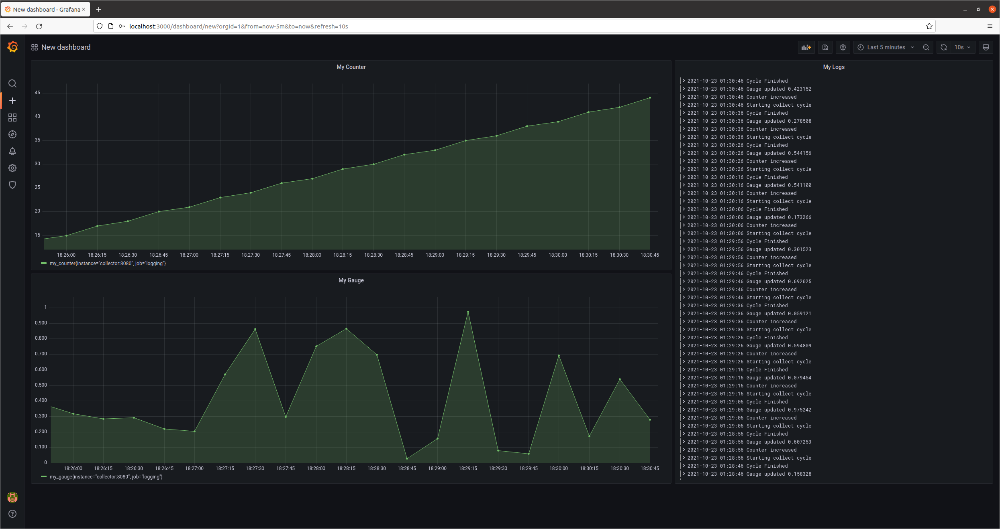

# Logging Example

## Structure

### Collector

Export numerical data for Prometheus and log data for Promtail.

- Exporter uses port 8080
- Log files are saved to `./collector/logs`

### Prometheus

Collects numerical data from Exporter.

- Server uses port 9090

### Loki

Store logs received from Promtail.

- Server uses port 3100

### Promtail

Collect string data from log files and send to Loki.

- Server uses port 9080
- Collects logs from files in `/logs`

### Grafana

Visualize data from Prometheus and Loki.

- Web server uses port 3000 (Accessible from host)

#### Grafana Data Sources

- Prometheus: `http://prometheus:9090`
- Loki: `http://loki:3100`

